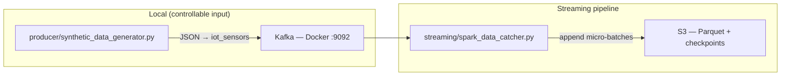

# Kafka IoT Streaming → S3

Portfolio project demonstrating a real-time data pipeline: **Kafka → Spark Structured Streaming → S3 (Parquet)**.

A local synthetic producer supplies repeatable IoT JSON events so the streaming and lake sink can be developed and demoed entirely from your machine — no hardware or external ingest required.

## Architecture



| Component | Role |
|-----------|------|
| **Synthetic producer** | Local, repeatable input source — simulates sensor readings you fully control |
| **Kafka** | Durable message buffer between producer and Spark |
| **Spark Streaming** | Consumes Kafka, parses JSON, writes Parquet micro-batches to S3 |
| **S3** | Data lake sink; checkpoint state stored separately for fault tolerance |

Spark appends a mini-batch every **30 seconds** (configurable via `SPARK_TRIGGER_INTERVAL`).

## Project structure

```
kafka_IoT_synth_data/
├── config/
│   ├── settings.py              # Central config (loads .env)
│   ├── schema.py                # Shared IoT event contract
│   └── logging_setup.py         # Console + file logging
├── producer/
│   └── synthetic_data_generator.py
├── streaming/
│   ├── spark_data_catcher.py
│   └── progress.py              # Batch progress log formatting
├── tests/
│   ├── test_schema_contract.py  # Producer ↔ Spark schema alignment
│   ├── test_config.py           # .env / AWS / Kafka / S3 validation
│   ├── test_bad_records.py      # Parsed-record filter + dead-letter contract
│   └── test_streaming_utils.py  # Progress log formatting
├── docker-compose.yml           # Local Kafka (KRaft)
├── requirements.txt
├── .env.example
└── README.md
```

## Prerequisites

- **Python 3.10+**
- **Java 8, 11, or 17** (required by Spark)
- **Docker** + Docker Compose (local Kafka)
- **AWS account** with an S3 bucket and credentials that can read/write the target paths

## Setup

### 1. Clone and install dependencies

```bash
git clone https://github.com/LesPat/kafka_spark_S3
cd kafka_IoT_synth_data
python -m venv .venv
source .venv/bin/activate
pip install -r requirements.txt
```

### 2. Local credentials (`.env` on your Mac)

Keep AWS keys **only** in a local `.env` file — never in code, never committed to Git.

```bash
cp .env.example .env
```

Edit `.env` with your real values:

```bash
AWS_ACCESS_KEY_ID=AKIA...
AWS_SECRET_ACCESS_KEY=...
AWS_REGION=us-east-1
S3_BUCKET=your-bucket-name
```

`.env` is gitignored. Spark reads these values at startup via `config/settings.py`.

Verify before running Spark:

```bash
pytest tests/test_config.py -v
```

If you use temporary/SSO credentials (access key starts with `ASIA`), also set `AWS_SESSION_TOKEN` in `.env`.

### 3. Start Kafka

```bash
docker compose up -d
docker compose ps          # wait until kafka is healthy
```

Broker address: `localhost:9092` (matches `KAFKA_BOOTSTRAP_SERVERS` default).

## Run the pipeline

Run from the **project root**, in separate terminals:

**Terminal 1 — synthetic input (start first)**

```bash
python producer/synthetic_data_generator.py
```

**Terminal 2 — Spark consumer (start after producer is sending)**

```bash
spark-submit streaming/spark_data_catcher.py
```

Stop Spark with `Ctrl+C` — both streaming queries shut down cleanly and progress is logged every 30s. To tear down Kafka:

```bash
docker compose down
```

## Log files

Application logs are written to **`logs/`** (gitignored) and mirrored to the terminal:

| Component | Log file |
|-----------|----------|
| Producer | `logs/producer.log` |
| Spark streaming | `logs/spark_streaming.log` |

Override the directory with `LOG_DIR` in `.env` if needed. Kafka broker logs remain in Docker: `docker compose logs kafka`.

### Recommended startup order

1. Kafka (`docker compose up -d`)
2. Producer (publishes to `iot_sensors`; topic is auto-created)
3. Spark consumer (`KAFKA_STARTING_OFFSETS=latest` — only reads messages that arrive after Spark starts)

To process messages already in the topic, set `KAFKA_STARTING_OFFSETS=earliest` in `.env`.

## Event schema

Each Kafka message is a JSON object:

| Field | Type | Example |
|-------|------|---------|
| `device_id` | string | `sensor_001` |
| `device_type` | string | `temperature`, `humidity`, `vibration`, `co2`, `sound` |
| `timestamp` | string (ISO 8601 UTC) | `2025-06-17T12:00:00+00:00` |
| `value` | number | `24.5` |
| `unit` | string | `°C`, `%`, `g`, `ppm`, `dB` |
| `status` | string | `OK`, `WARN`, `ALERT` |

Spark adds `event_time` (`timestamp` cast to `TimestampType`) and drops the raw string `timestamp` before writing. Invalid records are filtered out and written to a separate **dead-letter** path with the original JSON payload. Data is partitioned in S3 by `event_date` and `device_type`.

**S3 layout example (good records — v2 pipeline):**

```
s3://<bucket>/new_iot_streaming_data/event_date=2025-06-17/device_type=temperature/part-....parquet
```

**S3 layout example (dead letter — v2 pipeline):**

```
s3://<bucket>/new_dead_letter/iot_streaming_data/rejected_date=2025-06-17/part-....parquet
```

### v1 vs v2 S3 paths (portfolio evolution)

The improved pipeline writes to **`new_`-prefixed paths** so it never collides with the original flat-layout run:

| Version | Good data | Checkpoints |
|---------|-----------|-------------|
| **v1 (original)** | `iot_streaming_data/` | `checkpoints/iot_streaming_data/` |
| **v2 (current)** | `new_iot_streaming_data/` | `new_checkpoints/iot_streaming_data/` |

Same bucket, separate prefixes — old data stays untouched while you demo the evolved pipeline.

## Configuration reference

See [`.env.example`](.env.example) for the full list. Key variables:

| Variable | Default | Used by |
|----------|---------|---------|
| `KAFKA_BOOTSTRAP_SERVERS` | `localhost:9092` | Producer, Spark |
| `KAFKA_TOPIC` | `iot_sensors` | Producer, Spark |
| `KAFKA_STARTING_OFFSETS` | `latest` | Spark |
| `S3_BUCKET` | `real-time-processing-kafka-sink` | Spark |
| `S3_OUTPUT_PREFIX` | `new_iot_streaming_data/` | Spark |
| `S3_CHECKPOINT_PREFIX` | `new_checkpoints/iot_streaming_data/` | Spark |
| `S3_DEAD_LETTER_PREFIX` | `new_dead_letter/iot_streaming_data/` | Spark (invalid records) |
| `S3_DEAD_LETTER_CHECKPOINT_PREFIX` | `new_checkpoints/dead_letter/iot_streaming_data/` | Spark |
| `SPARK_TRIGGER_INTERVAL` | `30 seconds` | Spark |

## Verifying S3 output

After Spark has run for at least one trigger interval (~30s), check your bucket:

```bash
aws s3 ls s3://<S3_BUCKET>/new_iot_streaming_data/ --recursive
```

You should see Parquet part-files under Hive-style partitions, e.g. `event_date=2025-06-17/device_type=temperature/`. Checkpoint data lives under `new_checkpoints/iot_streaming_data/`.

## Testing

Schema contract and config validation tests run without Kafka or AWS:

```bash
pip install -r requirements.txt
pytest tests/ -v
```

Config tests catch common credential mistakes: missing keys, `.env.example` placeholders left in place, and temporary creds (`ASIA...`) without a session token.
